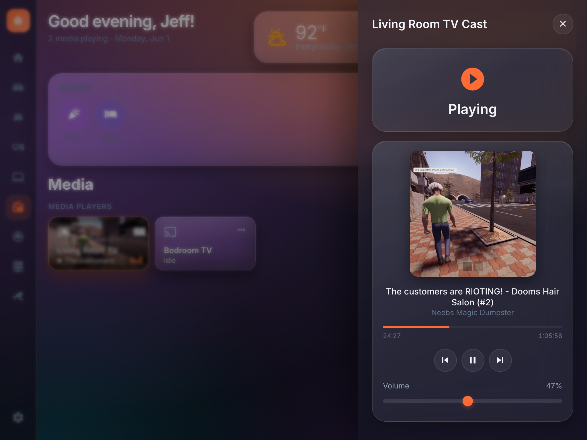
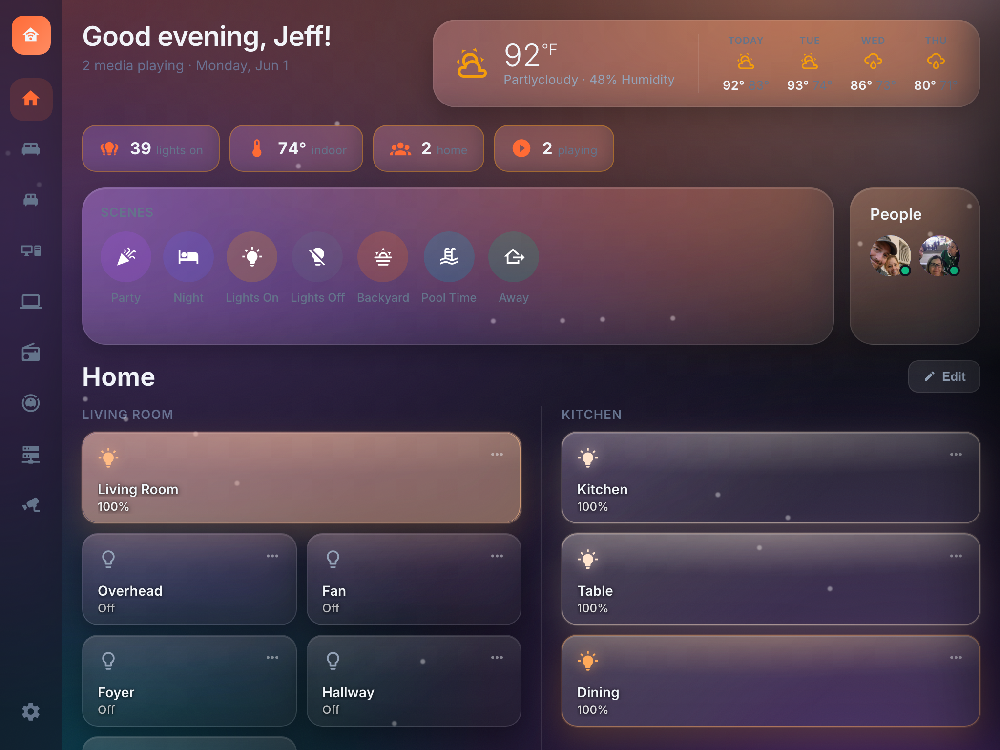
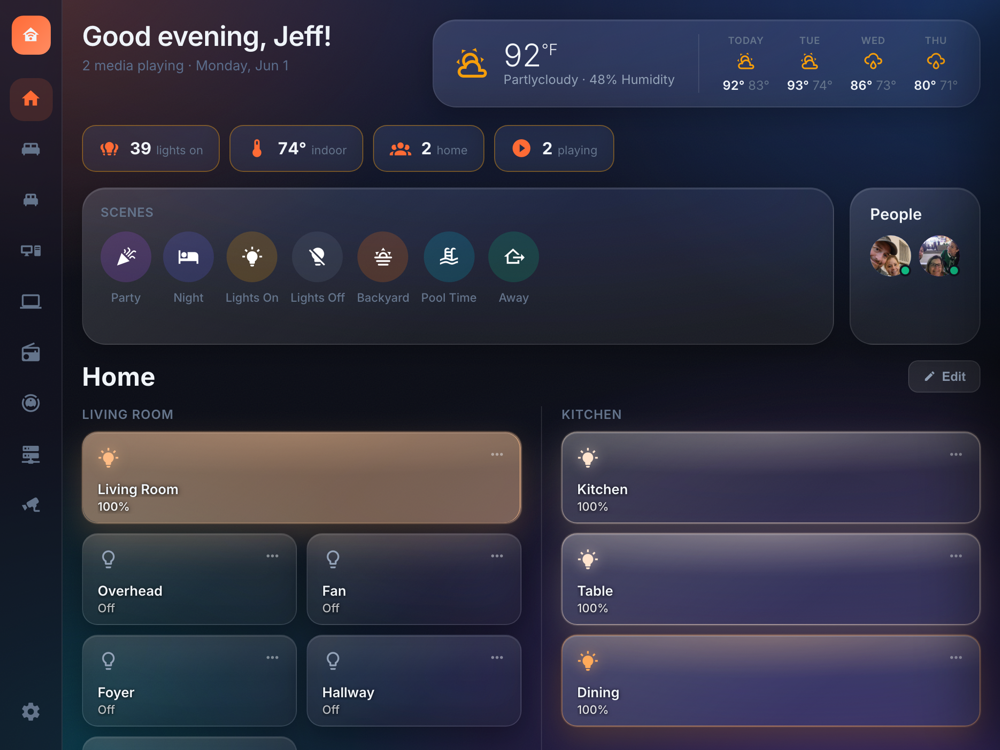
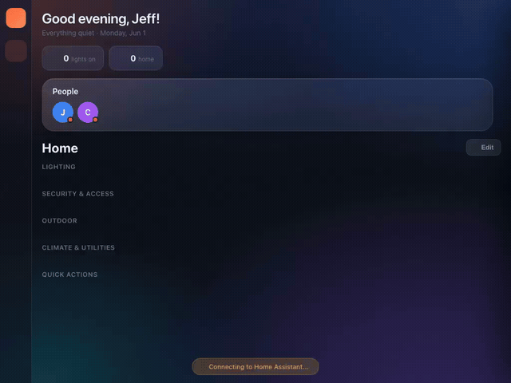
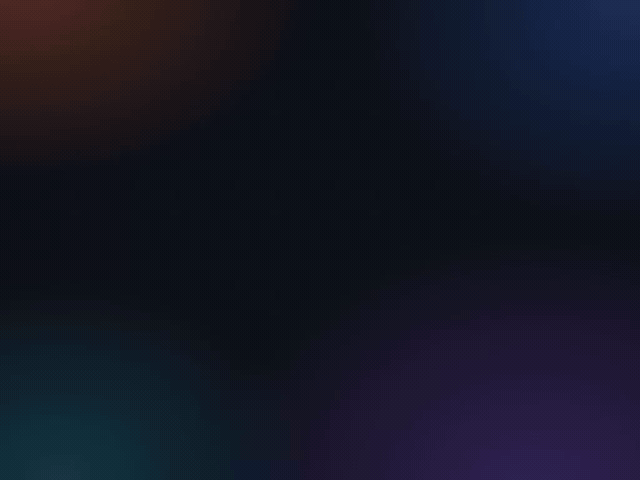
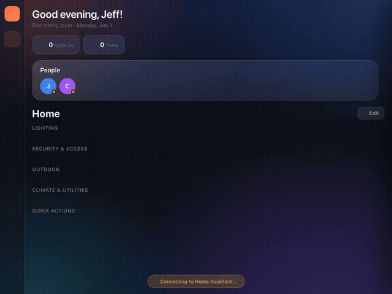

<p align="center">
  
</p>

# Glance — HA Dashboard

**Glance** is a custom, high-polish Home Assistant dashboard built with **React 19 +
TypeScript + Vite**. It talks directly to Home Assistant over its WebSocket API,
renders a fully editable tile/room layout, and layers on a lot of "premium feel"
motion and ambient effects.

> Companion file: [TODO.md](./TODO.md) tracks remaining ideas and decisions.

> 📖 **For full documentation** — installation, configuration, features, layout
> backup/restore, architecture, add-on development, and troubleshooting — see the
> **[Glance Wiki](https://github.com/jvenuto80/Dynamic-HA-Dashboard/wiki)**.

<a href="https://venmo.com/u/jvenuto" target="_blank" rel="noopener noreferrer"></a>

---

## Screenshots

|  |  |
|---|---|
|  |  |
| **Main dashboard** — editable tile/room layout | **Media flyout** — now-playing artwork, scrubber, transport |
|  |  |
| **NOC (servers) board** — device nodes, switch **port maps**, Internet/Storage/Power panels | **Switch port flyout** — per-port speed/role, PoE **power-cycle**, and node-to-node **uplink jump** |
|  |  |
| **Light flyout** — brightness, color, live glow | **Edit mode** — drag-and-drop tile arrangement |
|  |  |
| **Vacuum control center** — live map, room select, suction & mode | **Music Assistant** — search and cast to active players |
|  |  |
| **Settings** — themes, accent color, connection | **Ambient backdrop** — weather-reactive rain (with lightning in thunderstorms) |
|  |  |
| **Ambient backdrop** — snow particles | **Ambient backdrop** — night time-of-day tint |
|  |  |
| **Ambient backdrop** — dusk gradient | **Ambient backdrop** — rain + night combined |

### Responsive

The same layout reflows from a full-size wall display down to a phone screen.
On phones (portrait) the sidebar gives way to **swipe navigation** — swipe
left/right to move between pages — with a slim page-indicator at the bottom that
shows your position and lets you tap to jump straight to any page.


---

## Motion

Stills don't do the motion justice — these short clips show the live animations.

**View switching** — staggered tile-entrance cascade



**Media flyout** — spring-open with shared-element artwork morph


**Ambient backdrop** — weather-reactive rain particles



**Thunderstorm** — rain plus lightning flashes (toggle in Settings → Appearance)


**Light flyout** — brightness drag + warmth/color controls


**Edit mode** — drag-and-drop tile arrangement



**Vacuum control center** — app-like flyout with live map, room select, suction & cleaning mode


**Music Assistant** — search and cast to active players


---

## Quick start

```bash
npm install
npm run dev        # Vite dev server on http://localhost:3000
npm run build      # tsc -b + vite build  → dist/
npm run preview    # serve the production build
```

Strict TypeScript is enforced (`noUnusedLocals`); **the build must be 0 errors.**

### Connecting to Home Assistant

Connection values resolve in this order: **Settings (localStorage) → Vite env →
default**.

| Source            | Key                       |
| ----------------- | ------------------------- |
| Settings modal    | HA URL + long-lived token |
| `.env`            | `VITE_HA_URL`, `VITE_HA_TOKEN` |
| Hard default      | `http://homeassistant.local:8123` |

Copy `.env.example` → `.env` to set a URL/token at build time, or enter them in
the in-app Settings modal (saved to `localStorage`).

### Set up from scratch — no code required

Everything below is done in the running app; you never edit `config.ts` or
`layouts.json` by hand:

1. **Connect.** On first launch the **guided onboarding** asks for your HA URL and
   a long-lived token (create one in HA → *Profile → Security*), with a **Test**
   button to confirm before saving.
2. **Start blank.** Open **Settings → Dashboard data → Start blank** to clear the
   sample layout and begin with an empty **Home** page plus a zero-config
   **Media** page. (**Reset to default** restores the bundled sample instead.)
3. **Add pages.** Use **PagesManager** to create, rename, re-icon, reorder, and
   delete pages.
4. **Add tiles.** In **Edit mode**, click **+ Add Tile** and pick any entity from
   the searchable picker (lights, switches, covers, locks, climate, media,
   **vacuum**, sensors, scenes, scripts, buttons, and more). Drag to arrange;
   open **per-tile settings** for camera entity, links, quick actions, flyout
   options, slider direction, and size.
5. **Add scenes.** Each page has a scene picker; scenes you add show with their HA
   friendly name and icon automatically.
6. **People appear automatically.** Every `person.*` entity is discovered and
   shown in the header / People tracker — no configuration needed.
7. **Weather appears automatically.** The header forecast + ambient backdrop pick
   up any `weather.*` entity; choose a specific one in Settings → Appearance if
   you have several.
8. **Theme it.** Pick a theme + accent color in Settings.
9. **Monitor infrastructure (optional).** Switch any page to the **NOC (servers)**
   board type in **Manage Pages** to build a monitoring dashboard for servers,
   UPSes, switches and Docker — see [NOC / Servers dashboard](#noc--servers-dashboard).

The bundled `config.ts` catalogs (sample `scenes`, `persons`, and `rooms`) are
only a starting **seed**; a connected user can replace all of it from the UI, and
**Start blank** gives them a clean slate to do so.

---

## Run as a Home Assistant Add-on

Prefer to run it on the HA server itself? The dashboard ships as a
Supervisor-managed add-on (served from the sidebar via **Ingress**).

[](https://my.home-assistant.io/redirect/supervisor_add_addon_repository/?repository_url=https%3A%2F%2Fgithub.com%2Fjvenuto80%2FDynamic-HA-Dashboard)

Click the button above to open the **Add repository** dialog pre-filled in your
own Home Assistant, then click **Add**.

> **Heads-up:** the button only *adds the repository* — it does not install the
> add-on, and on some HA/browser versions it just opens the Add-on Store without
> popping the dialog. If that happens, use the manual steps below.

**Manual install (always works, HA OS / Supervised):**

1. **Settings → Add-ons → Add-on Store**.
2. Top-right **⋮** menu → **Repositories**.
3. Paste this URL and click **Add**, then **Close**:
   ```
   https://github.com/jvenuto80/Dynamic-HA-Dashboard
   ```
4. Refresh the store (pull-to-refresh / reload). A new **Glance — HA Dashboard
   Add-ons** section appears.
5. Open **Glance — HA Dashboard** → **Install** → **Start** → **Open Web UI**
   (it also appears as **Glance** in the sidebar).

> First install builds from source on your device (clones the repo + `npm run
> build`), so it can take several minutes and needs internet access. Requires a
> Supervisor (HA OS or Supervised) — HA Container/Core have no add-on store.

See [`addon/README.md`](addon/README.md) for first-time token setup and layout
import/export.

---

## Architecture

```
src/
  main.tsx            App bootstrap: applyTheme(), installHaptics()
  App.tsx             Top-level shell: sidebar, header, views, detail flyout
  config.ts           Seed catalogs (sample scenes[]/persons[]/rooms[], HA_URL/TOKEN); replaceable from the UI
  settings.ts         App settings (localStorage) + applyTheme()
  types.ts            Shared layout / entity types

  hooks/
    useHomeAssistant.ts  WebSocket connection, entity state, callHA, history/forecast
    useLayout.ts         Loads/saves the layout (views, tiles, glance); export/import; startBlank/reset
    useArtworkColor.ts   Extracts a dominant color from now-playing artwork

  lib/
    layout.ts          viewRows() and layout helpers
    tileSize.ts        Tile span/size logic
    glance.ts          At-a-glance metric catalog + computeMetric()
    mediaDevices.ts    Media de-dup: friendlyName, deviceNameKey, group/dedupe (+ manual merges)
    persons.ts         resolvePersons(): auto-discover person.* (config names override)
    weather.ts         resolveWeatherId(): auto-discover/select the weather.* entity
    colorExtract.ts    Canvas-based dominant-color extraction
    viewTransition.ts  View Transitions API wrapper (shared-element morphs)
    haptics.ts         navigator.vibrate + delegated press listener
    entityInfo.ts      Per-domain display helpers

  components/          One component per surface (see Features below)
  styles/theme.css     All styling + animations (single stylesheet)

vite-layout-plugin.ts  Dev/preview middleware: GET/POST/DELETE /layout (honors LAYOUT_FILE)
layouts.json           Persisted custom layout (on the add-on: /data/layouts.json)
```

### Data flow

- `useHomeAssistant` opens the WS connection, subscribes to entity states, and
  exposes `entities`, `connected`, `error`, `callHA(domain, service, …)`,
  `getForecast`, and `getHistory`.
- `useLayout` loads the editable layout from `/layout` (falls back to a default),
  and writes changes back via the Vite middleware to `layouts.json` (or
  `/data/layouts.json` on the add-on). It also exposes `exportLayout()` /
  `importLayout()` for moving a dashboard between devices/deploys — these now
  serialize a versioned `{ settings, views }` backup (appearance prefs + layout)
  and import accepts both that and the legacy bare-array format.
- `App` resolves the active view, renders its scenes + tiles, and owns the
  `DetailPanel` flyout (entity controls, camera, history, links, quick actions).

---

## Features

### Layout & editing
- **Multiple views/pages** with a left **Sidebar** + **RoomNav**. On phones the
  sidebar gives way to **swipe navigation** (swipe left/right between pages) with
  a tappable page-indicator.
- **Compact sections** (Settings → Appearance, on by default) — flows whole
  sections into a responsive masonry so short sections sit side-by-side and fill
  the screen width, instead of each claiming a full-width band with a tall empty
  gap underneath. Section headings and separation stay intact; sections never
  split across columns; column count scales with the viewport. Far less vertical
  scrolling on smaller tablets. Turn it off to stack every section full-width.
- **Edit mode** — drag-and-drop tiles (`@dnd-kit`), add/remove tiles, add/reorder/
  remove scenes per view, reset to defaults. Saved to `layouts.json` (syncs across
  devices on the same host; persists to `/data` on the add-on).
- **Per-tile settings** (`TileSettings`) — camera entity, links, quick actions,
  flyout config, reverse slider, custom artwork entity, tile size/span.
- **Layout export / import** (Settings → Dashboard data) — download a complete,
  self-describing backup as JSON and re-import it on a new device or deploy. The
  file bundles **everything you build**: all views, tiles and at-a-glance buttons
  (including every NOC node, pill, **switch port** — with its speed, client name,
  PoE / power-cycle / speed / link entity bindings, role and node-to-node link —
  panel and per-board greeting/weather/people toggle) **and** your appearance
  preferences (theme, accent, weather source, ambient/compact toggles, and the
  date &amp; duration formats). Your Home Assistant URL and token are intentionally
  left out so the file is safe to share or move between machines. Older bare-array
  exports still import unchanged.
- **Start blank / Reset** (Settings → Dashboard data) — **Start blank** wipes the
  layout to an empty Home page + auto-filling Media page for a clean no-code
  start; **Reset to default** restores the bundled sample layout.
- **Auto-discovered people** — every `person.*` entity shows in the header and
  People tracker with its friendly name, no config needed (a `config.persons`
  entry can still override the display name).
- **Weather, no hard-coding** — the header forecast and ambient backdrop
  auto-discover a `weather.*` entity; pick a specific one in **Settings →
  Appearance → Weather entity** (or leave it on **Auto**).

### Tiles & cards
- `DeviceTile` — lights, switches, media players, covers, locks, buttons, etc.
  with slide-to-dim, **slide-to-set-position for covers**, live artwork
  backgrounds, and per-domain controls. Slide gestures are on by default for all
  light and cover tiles.
- `ClimateCards`, `LockCards`, `VacuumCard`, `CameraGrid`, `SensorWidgets`,
  `RoomCard` / `RoomPanel`, `PersonTracker`, `Sparkline`, `ScenePills`.
- **App-like vacuum control** — the vacuum tile shows the **live map** as its
  background with battery, status and quick Clean/Dock buttons; its flyout is a
  full control center (large live map, status summary, Clean/Stop/Dock/Locate,
  suction + cleaning-mode selectors with friendly **Vac & Mop / Vac / Mop / Vac →
  Mop** labels, per-room selection with one-tap clean, and maintenance bars for
  brushes/filter/sensors). Built for the Dreame (Tasshack `dreame_vacuum`)
  integration. **Add it yourself** by picking any `vacuum.*` entity in the tile
  picker — the rich tile + flyout apply automatically, and the map, rooms, modes
  and consumables are all auto-discovered from the entity's companion
  `camera.*_map` and `select.*` entities (it degrades gracefully for non-Dreame
  vacuums).
- `DashboardView` renders a view's scenes + tile grid; `RoomNav` switches rooms.
- `DetailPanel` flyout — full controls, camera feed, history graph, scenes, links.

### Media & Music Assistant
- **Auto "Now Playing" media view** (`MediaAutoView`, page `kind: 'media'`) —
  automatically lists every media device and shows transport controls only when
  something is actually playing on that device. No manual tile placement needed.
- **Media de-duplication** (`lib/mediaDevices.ts`) — one physical device that
  exposes several `media_player` entities (e.g. an Android TV with ADB + Cast +
  remote) is collapsed to a single entry. The same matching rule feeds the Media
  page, the header subtitle, and the at-a-glance strip so they always agree.
- **Manual merge** — when name heuristics can't tell two entities are the same
  device (abbreviations, possessives), select them in the Media page edit mode
  and **Merge into one**; a badge + split button let you undo. Persists on the
  view (`view.mediaMerge`).
- **Per-page controls (edit mode)** — type-ahead device filter to show/hide
  devices, a **Small / Medium / Large** tile-size selector (fixed-width columns
  so a lone playing tile doesn't span the page), and a toggle for the Music
  Assistant button.
- **Music Assistant search** (`MusicAssistantSearch`) — search the MA library
  (artists, albums, tracks, playlists) from a right-side flyout and tap a result
  to play it on any MA player. Player list is filtered to MA devices via the
  entity registry and narrowed to **only active (available) players** — players
  disabled in Music Assistant drop off, while sync/speaker groups remain; a
  custom dark-theme dropdown stays readable and open while choosing; artwork
  shows by default (opt-out per tile).

### In-app page management
- **PagesManager** — create, rename, re-icon, reorder, and delete pages directly
  in the app, no layout JSON editing by hand. Each page also has a **board-type**
  selector (**Tiles**, **Sensor graphs**, **NOC (servers)**, **Cameras**, **Now
  Playing**) and **per-page header toggles** to hide the greeting/weather/people.
- **NOC (servers) board** — a monitoring page for infrastructure (servers,
  gateways, switches, NVRs, UPSes, Docker). Device **nodes** bundle threshold-bar
  metrics, a status LED, status-keyword + container-down **alerts**, a configurable
  **sparkline**, footer **pills**, a UniFi-style **switch port map** (color-coded
  by link speed, with **PoE power-cycle**), and bottom **Internet / Storage /
  Power** panels — all user-creatable, with a **live tile preview** while editing.
  See [NOC / Servers dashboard](#noc--servers-dashboard).
- **Guided onboarding & empty states** — first-run guidance, friendlier
  empty/loading states, and optimistic toggles (tiles respond instantly and
  reconcile with HA).

### Theming
- 4 themes: **Midnight, Slate, OLED Black, Light** (Settings modal).
- **Accent color** picker (8 swatches + custom). `applyTheme()` sets
  `--accent-orange`, `--accent-primary`, and an **`--accent-rgb` triplet** so the
  accent recolors the entire UI (all `rgba(var(--accent-rgb), …)` usages and
  `color-mix` gradient stops — no more hardcoded orange).
- **Date & time format** — choose how timestamps render (e.g. `MM/DD/YY · 12-hour`,
  `DD/MM/YY · 24-hour`, `YYYY-MM-DD`, or your system locale) and a **duration /
  uptime style** (`3d 4h 23m`, `3:04:23:24`, or words). Everything is drawn in the
  **browser's own timezone**, and uptime/boot sensors are auto-shown as elapsed
  time.

### "Premium feel" polish

**Top picks**
- **Album-art color extraction** — dominant color from now-playing artwork tints
  the media tile/flyout glow (`useArtworkColor` + `colorExtract`).
- **Shared-element artwork → flyout** — media artwork morphs into the flyout via
  the **View Transitions API** (`viewTransition.ts`). The morph *is* the entrance,
  so the spring doesn't double-fire (`vt-active` flag managed by App's `onClose`).
- **Animated media progress bar / equalizer** — interpolated playback position +
  a bouncing EQ badge on playing media tiles.
- **At-a-glance header strip** (`GlanceStrip`) — a row of summary buttons
  (lights on, who's home, climate, media, etc.). **Fully configurable in edit
  mode**: pick each button's metric, set a custom label, toggle its flyout, and
  build a per-button exclude list (tablet/kiosk screen lights are filtered by
  default). Config persists on the view (`view.glance`) so it syncs across
  devices. The header **greeting is dynamic** — it names whoever is actually
  home from the `person.*` states (e.g. "Good night, Jeff & Carissa!"). When
  nobody is home it drops the names entirely and shows just the time-of-day
  greeting ("Good morning").
- **Haptics + spring press** — `lib/haptics.ts` installs one delegated
  `pointerdown` listener firing `navigator.vibrate(8)` on touch/pen taps over
  interactive surfaces (no-op on desktop/mouse). Tiles/pills snap to `scale(0.95–
  0.97)` on `:active`.

**Motion & micro-interactions**
- Spring-physics flyout open (scale + blur-in).
- Staggered tile entrance cascade on view switch (`--enter-i` index, ~28ms steps).
- Animated value transitions — `AnimatedNumber` count-up for temps/weather,
  smooth brightness fills, crossfading album art on track change.

**Living, ambient feel** (`AmbientBackdrop`)
- **Time-of-day ambiance** — `data-tod` (dawn/day/dusk/night) drives a soft-light
  gradient tint, refreshed each minute.
- **Weather-reactive backdrop** — subtle rain streaks / snow flakes driven by the
  weather entity (`weather.forecast_home_2`); nothing renders for clear weather.
- **Live light color** — a light tile's glow matches its real RGB / color-temp.

All animations respect **`prefers-reduced-motion: reduce`**.

---

## NOC / Servers dashboard

Glance pages come in **board types**. Most pages are the **regular dashboard view**
(rooms, tiles and cards for controlling lights, locks, climate, media, etc.). The
**NOC (servers)** board is a different kind of page built for **monitoring
infrastructure** at a glance — servers, gateways, switches, NVRs, UPSes, Docker
containers and internet/storage/power health.


### NOC view vs. the regular view

| | **Regular view** (Tiles / Sensor graphs / Cameras / Media) | **NOC (servers) view** |
|---|---|---|
| **Purpose** | **Control** devices — tap to toggle, dim, set, play | **Monitor** infrastructure — read status at a glance |
| **Building block** | Entity **tiles** you place and drag | Device **nodes** (a server/switch/UPS) each bundling several sensors |
| **Interaction** | Tap a tile to actuate; long-press / flyout for detail | Tap a node to open a read-only **flyout** with metrics, containers & history |
| **Top of page** | Greeting + weather + people header | A live **status banner** ("All Systems Operational" / "N devices need attention") with summary chips, plus the same header (which you can hide — see below) |
| **At-a-glance** | Glance strip (lights on, who's home…) | Per-node **threshold bars**, status **LED**, alert **chips**, a mini **sparkline**, and bottom **Internet / Storage / Power** panels |
| **Alerts** | None (it's a control surface) | Threshold **warn/crit** colors, **status-keyword** alerts (e.g. a UPS "Replace Battery"), and **container-down** detection that rolls up into the banner |
| **Underlying kind** | `kind: 'tiles' \| 'sensors' \| 'cameras' \| 'media'` | `kind: 'sensors'` **with a `noc` config attached** |

> Under the hood a NOC page is just a **sensor page that has a `noc` config**. The
> board-type selector flips this for you — you never edit JSON.

### How to switch a page to NOC (or back)

1. Enter **Edit mode** (pencil) and open **Manage Pages** (or **Settings →
   Manage Pages**).
2. On the page you want, use the **board-type dropdown** and choose
   **NOC (servers)**. (The same dropdown offers Tiles, Sensor graphs, Cameras and
   Now Playing — switching back to **Tiles** restores a normal control page.)
3. Optionally hide the **greeting / weather / people** header widgets for that page
   with the three header toggles next to the dropdown — handy for a clean,
   wall-mounted NOC screen. This is **per page**, so your other pages keep their
   header.

### Set up a NOC page (no code required)

Everything below is done in the app's **Edit mode** — nothing is hardcoded, and
**every node, metric, pill, panel and chip is user-creatable and editable**.

1. **Auto-detect (optional head start).** On an empty NOC page, click
   **Auto-detect** to scaffold nodes from sensors it recognizes (UPS, gateway,
   storage…). You can then edit or delete anything it guessed.
2. **Add a device node.** Click **+ Add Device**. Give it a **name**, **subtitle**,
   an **icon** (any `mdi-…` class or a single emoji) and an **accent color** (drives
   its LED, bars and sparkline).
3. **Add metrics.** Each metric points at one sensor and renders a labeled
   **threshold bar**. Set **unit**, **max** (full-scale), and **warn/crit**
   thresholds. Toggle:
   - **Lower = bad** — inverts the comparison for metrics where *less* is worse
     (battery %, runtime, free space).
   - **Info only** — show the gauge but **never raise an alert** (e.g. an NVR's
     continuous-recording disk that's *designed* to sit near-full, so a full disk
     isn't really an alert).
   - **Tile vs. Graph** — mark up to **3** metrics as **primary** to show on the
     compact tile; the rest live in the flyout.
4. **Pick the sparkline metric.** Each tile draws one mini **sparkline**; choose
   which metric it tracks (e.g. CPU vs. throughput vs. battery charge). A small
   **key** under the spark labels what it's showing.
5. **Add pills & reachability.** Optional footer **pills** (ports, cameras, parity,
   power draw, uptime…) — each is an entity with an icon/label/unit. Optionally set
   a **temperature** and **uptime/info** entity, and a **reachability**
   (`binary_sensor`) that marks the node up/down. **Dates & uptime are formatted
   automatically**: a sensor that reports a *boot timestamp* (e.g. an "UNVR Uptime"
   that reads `2026-06-04T13:23:00+00:00`) is shown as **elapsed uptime**
   ("`1d 7h`"), a duration counter as "`3d 4h 23m`", and any other timestamp as a
   real date in **your browser's timezone**. Per pill (and per node's uptime) you
   can override the mode — Auto, Elapsed/uptime, Date+time, Date, Time, Duration or
   Raw. The **date pattern** (e.g. `MM/DD/YY · 12-hour`) and **duration style**
   (`3d 4h 23m` vs. `3:04:23:24`) are picked once in **Settings → Appearance**.
6. **Status-keyword alerts.** When a node has a status entity (e.g. a UPS NUT
   status sensor), add comma-separated **Critical** and **Warning** keywords. If the
   status text contains one (case-insensitive), the node shows a colored alert chip.
   Real-world UPS example: Critical = `replacement, alarm, on battery, low battery,
   overload`; Warning = `bypass, boost, trim, calibrat, discharg`. This is what
   surfaces a failing battery's **"Battery Needs Replacement"** flag.
7. **Watch Docker containers (server nodes).** Point a node at container
   `switch`/`binary_sensor` entities (or **Add all running** matching the node
   name). Any watched container that isn't running raises a node alert and bumps the
   banner's **Containers** chip.
8. **Bottom panels.** Add **Internet / WAN**, **Storage** and **Power** panels at
   the page bottom — all editable:
   - **Internet/WAN** — named stat numbers + a charted latency series, **plus
     external API stats** (e.g. pull **download/upload** from a **Speedtest-Tracker**
     container's JSON API: give it the URL, optional bearer token, a dotted JSON
     **path**, unit and a **multiplier** like `1e-6` for bits→Mbps).
   - **Storage** — capacity **rings**; add a **sublabel** sensor and a **suffix**
     (`used` / `free`) so a "19.1 TB" reading is never ambiguous.
   - **Power** — **UPS gauges** (battery %, runtime, load, draw, status).
9. **Switch ports (port map).** Switch nodes can show a **UniFi-style port strip**
   along the bottom of the tile — each port a cell **color-coded by link speed**
   (FE / GbE / 2.5G / 5G / 10G / SFP / SFP+, plus *Disconnected* and *Disabled*),
   with a **PoE** lightning badge and uplink/aggregate/mirror role glyphs. In the
   builder, add ports individually or in bulk (**+8 / +24**) — or hit
   **Auto-detect ports** to map the whole switch in one click. It reads the live
   UniFi entities, shows **every physical port** (including disconnected ones)
   up to the switch's port count, names each active port after its **connected
   client**, sets its **live link speed/color**, and binds the per-port
   **power-cycle button** + PoE switch automatically. **SFP / SFP+ ports are
   detected** and set off from the
   RJ45 bank by a one-port gap, just like a real switch faceplate. A port's color
   comes from a manual **speed** dropdown, or bind a live **Mbps sensor** to drive
   it automatically; bind a **connectivity
   entity** to flip it to *Disconnected* when the link drops. Bind the **PoE switch
   entity** (Home Assistant's UniFi integration exposes `switch.<device>_port_<N>_poe`)
   to unlock, in the node's **flyout**, a per-port **PoE on/off toggle** and a
   **Power-cycle** action (turns PoE off, waits the configurable *cycle* seconds,
   then back on — handy for rebooting a stuck AP or camera). On UniFi gear it
   prefers the integration's dedicated `button.<…>_power_cycle` when present. Tap
   any cell in the flyout to see its details; the **Open in HA** button (labelled
   with the entity's name) jumps to that port's underlying entity in Home
   Assistant for its full history and attributes.
   - **Link a port to another device.** Give any port (e.g. an SFP+ **uplink**) a
     **→ link** to another NOC node. The port's flyout then shows an **Open
     &lt;device&gt;** jump button, and the **target node's flyout automatically
     shows a jump back** — no need to configure both ends. Great for hopping
     between a switch and the gateway it uplinks to.
10. **Banner chips.** The summary chips (Devices Up, WAN latency, Clients,
    Containers) are configurable; add a custom **entity** chip for anything else.


> **All of this is saved in your backup.** Every port — its speed/color, client
> name, PoE/power-cycle/speed/link entity bindings, role, and node-to-node link —
> lives inside the page config and is included when you **export your layout**
> (and restored on import). See [Layout & editing](#layout--editing).

### Live preview while editing

The NOC builder now shows a **live preview of each device tile right next to its
form**. As you type a name, change thresholds, pick a sparkline metric or add a
pill, the preview tile **updates instantly** — no need to save, switch out of edit
mode to verify, then come back. (On narrow screens the preview drops below the
form.)

---

## Dev preview overrides

`AmbientBackdrop` reads URL query params so ambient effects can be previewed
regardless of real conditions (kept intentionally for tweaking):

| Param                | Values                     | Effect                          |
| -------------------- | -------------------------- | ------------------------------- |
| `?precip=`           | `rain` `snow` `none`       | Force the precipitation layer   |
| `?tod=`              | `dawn` `day` `dusk` `night`| Force the time-of-day tint      |

Example: `http://localhost:3000/?precip=snow&tod=dusk`. No params = real
weather/clock. Particles are suppressed under reduced-motion.

---

## Settings persistence

App settings (HA URL, token, theme, accent) save to **`localStorage`** per
browser/device by default. The dashboard **layout** saves server-side to
`layouts.json` via the Vite middleware — shared across devices on the same host,
and persisted to `/data/layouts.json` when running as the add-on.

**Remember connection on this server** (opt-in) — enabling the toggle in
**Settings → Home Assistant** also stores the URL + token server-side
(`connection.json`, `/data/connection.json` on the add-on). New devices with no
local token automatically adopt it on first load, so tablets/kiosks connect
without pasting the token. It's off by default (token stays per-device); turning
it off clears the stored connection. The file is gitignored and never committed.

---

## Tech stack

- React 19.1, TypeScript ~5.8 (strict), Vite 6
- `home-assistant-js-websocket` for the HA connection
- `@dnd-kit/*` for drag-and-drop editing
- Material Design Icons (`mdi-*` classes)
- Single stylesheet: `src/styles/theme.css`

---

## License

Copyright (c) 2026 Jeff Venuto. All rights reserved. See [LICENSE](./LICENSE).

You may use, modify, and share this project **for free, with attribution** to
the Owner and a link back to this repository. You may **not sell it** or use it
for commercial gain, and derivatives must keep these same terms.

---

## Support

If this dashboard made your home feel a little more premium, you can say thanks:

<a href="https://venmo.com/u/jvenuto" target="_blank" rel="noopener noreferrer"></a>
